Partie 1: CI

1)  Installer Jenkins.

</img>

</img>

</img>

2)  \-

3)  

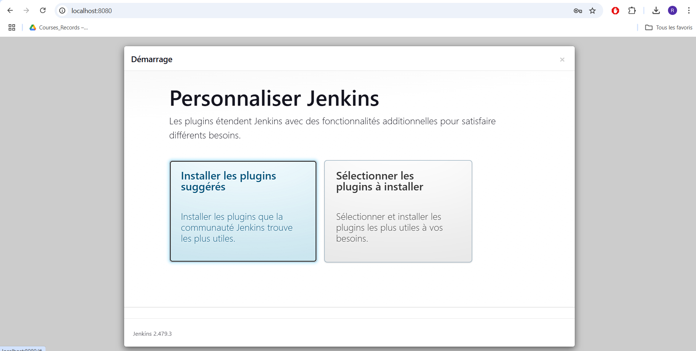

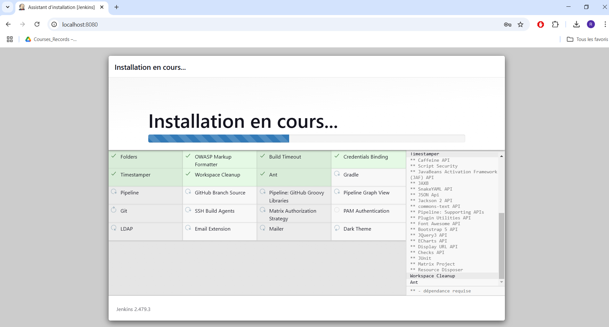

4)  --

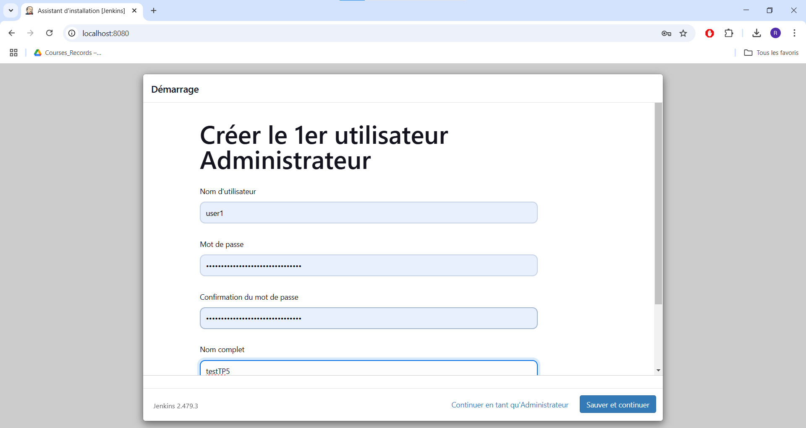

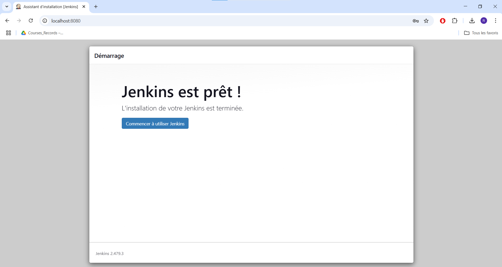

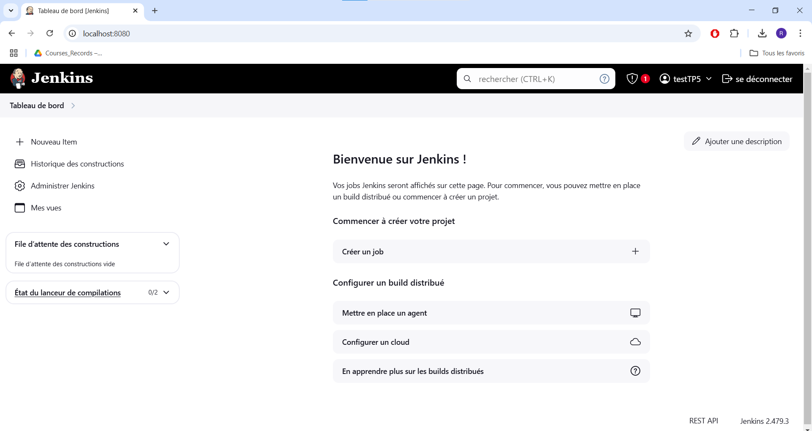

5)  Ajouter des plugins docker à Jenkins.

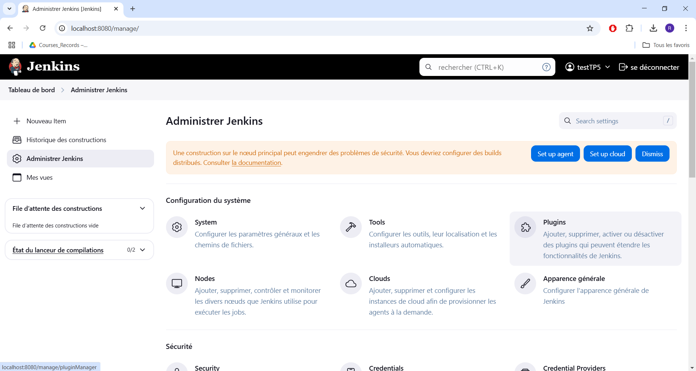

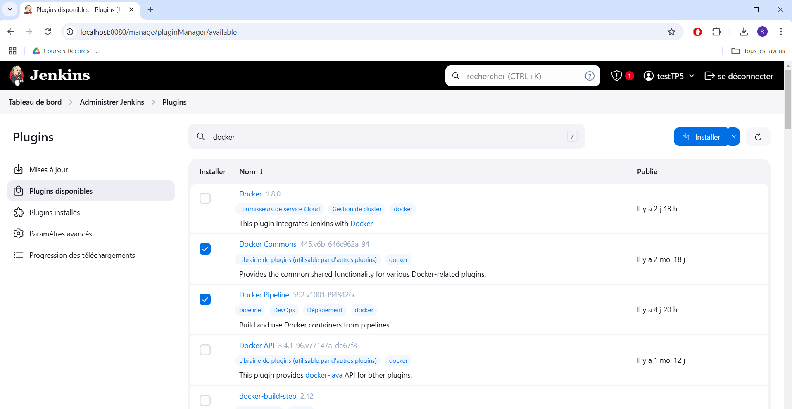

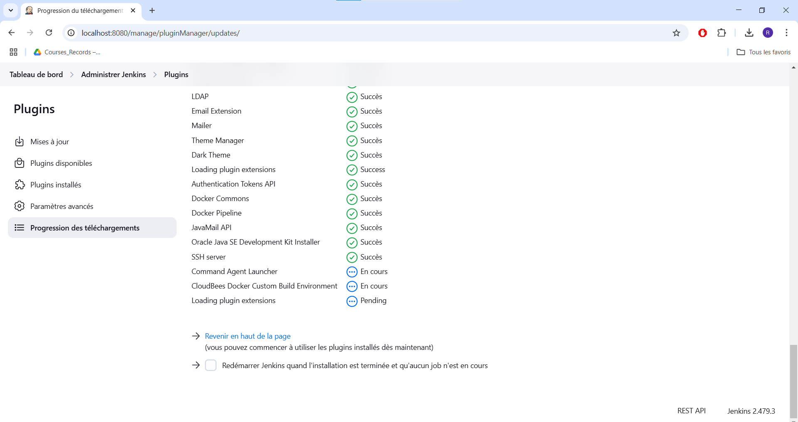

6)  

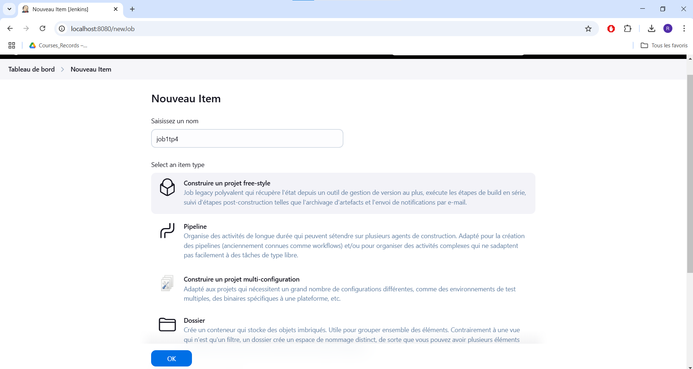

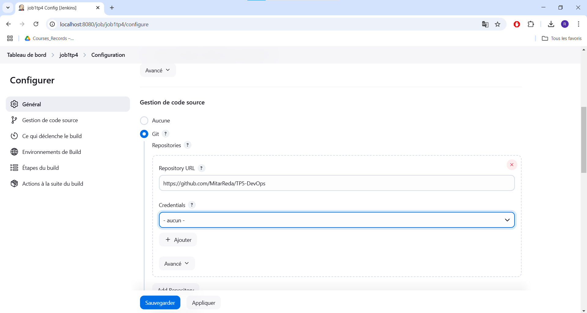

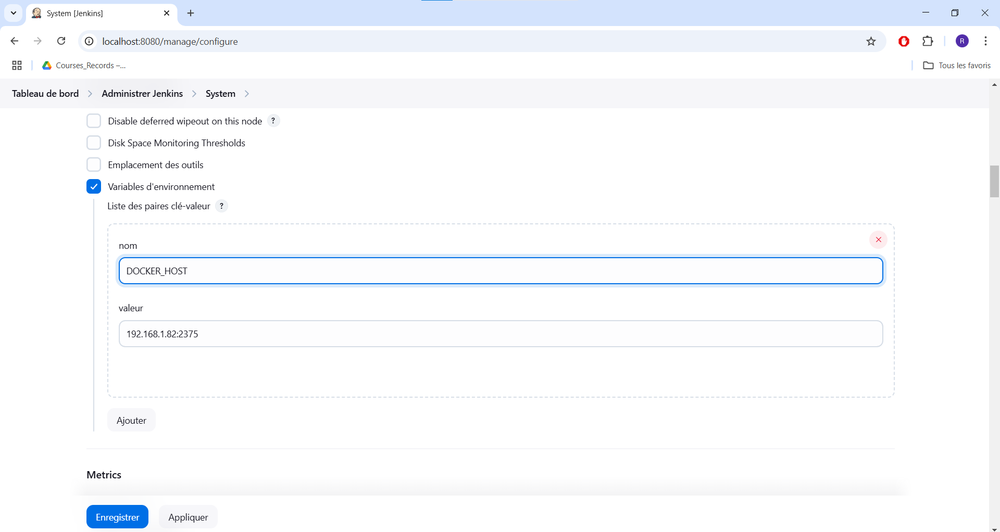

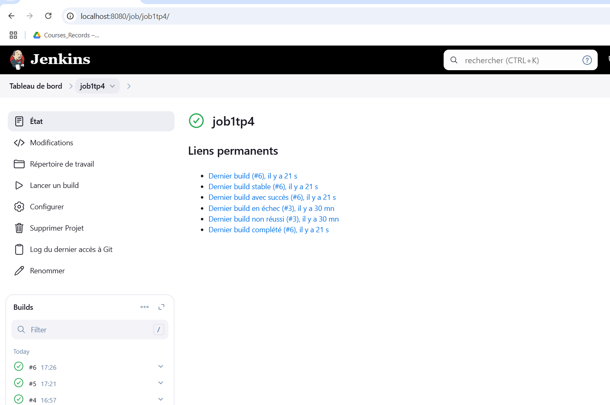

Partie 2: CI/CD (continuous integration/continuous deployment)

