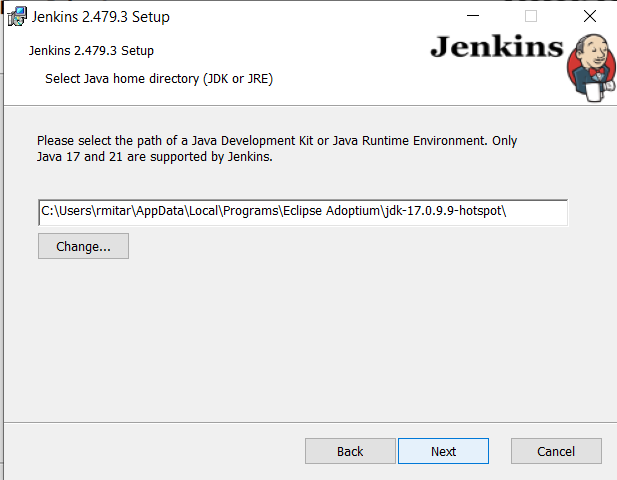
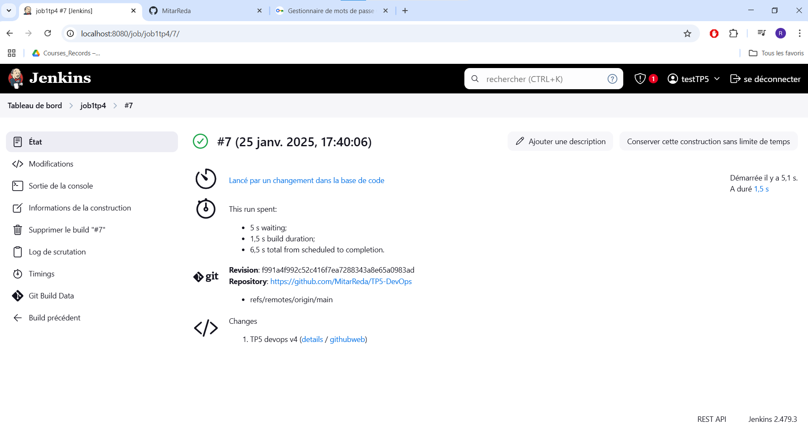

Partie 1: CI

1)  Installer Jenkins.

</img>

</img>

</img>

2)  \-

3)  

4)  --

5)  Ajouter des plugins docker à Jenkins.

6)  

Partie 2: CI/CD (continuous integration/continuous deployment)

