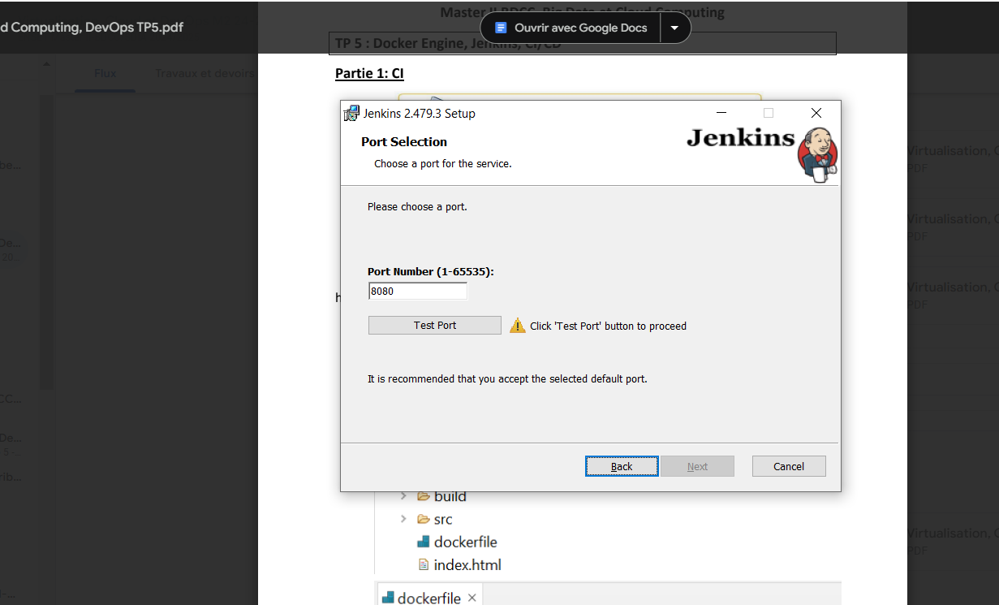
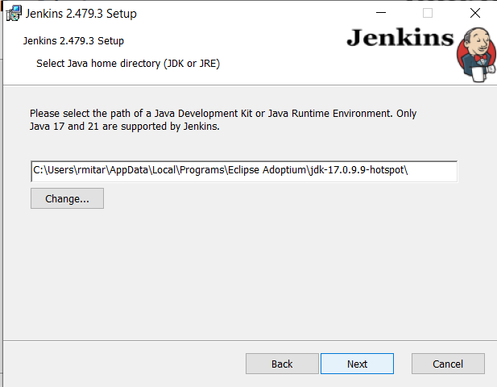
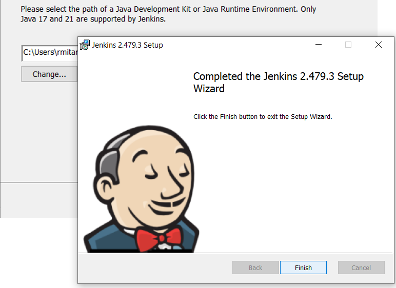
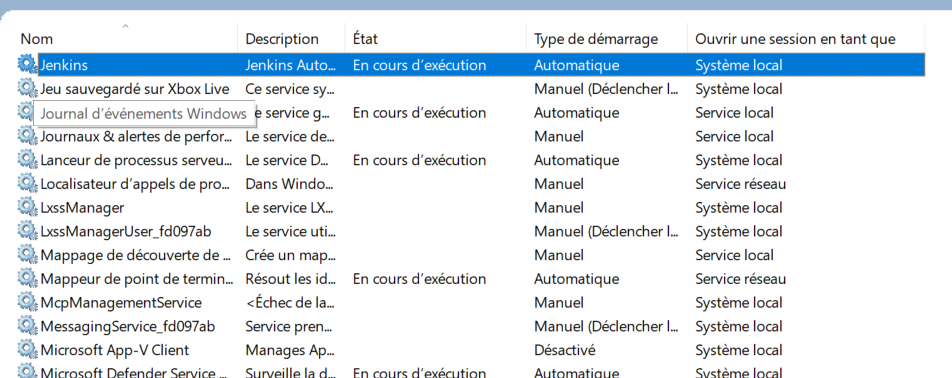
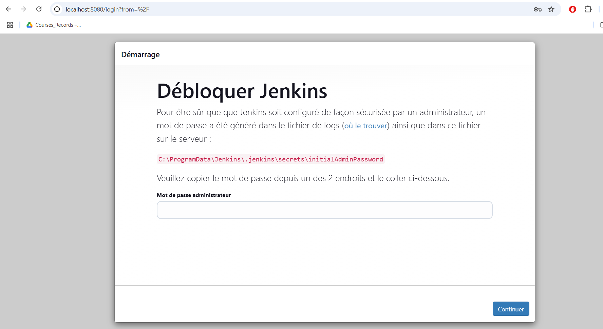

Installer Jenkins.

1)  \-

</img>

{width="6.3in"
height="3.8125in"}

{width="5.14211176727909in"
height="4.000346675415573in"}

{width="6.3in"
height="4.586111111111111in"}

{width="6.3in"
height="2.501388888888889in"}

2)  \-

{width="6.3in"
height="3.4458333333333333in"}

3)  

{width="6.3in"
height="3.183333333333333in"}

{width="6.3in"
height="3.3819444444444446in"}

4)  --

{width="6.3in"
height="3.35in"}

{width="6.3in"
height="3.3520833333333333in"}

{width="6.3in"
height="3.3472222222222223in"}

5)  Ajouter des plugins docker à Jenkins.

{width="6.3in"
height="3.3666666666666667in"}

{width="6.3in"
height="3.2631944444444443in"}

{width="6.3in"
height="3.3402777777777777in"}

6)  

{width="6.3in"
height="3.3555555555555556in"}

{width="6.3in"
height="3.3631944444444444in"}

{width="6.3in"
height="3.3534722222222224in"}

{width="6.3in"
height="3.3243055555555556in"}

{width="6.3in"
height="4.1875in"}
